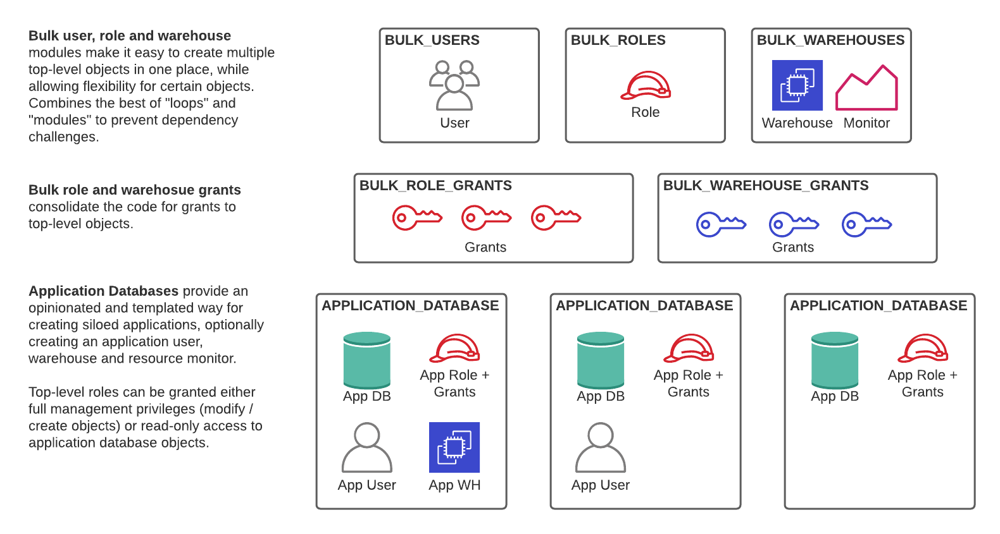

# terraform-snowflake-fast-data-warehouse

Set up your data warehouse with speed and style using [Terraform's Snowflake provider](https://github.com/chanzuckerberg/terraform-provider-snowflake).

Much of the work done in creating a data warehouse is the same old story:

1. Create some roles, warehouses, and users.
2. Create a database for some limited purpose, such as a developer database or application database.
3. Create a highly privileged role for administering that database, and give read access for to other roles.
4. Repeat, again and again, for each new application you add.

This set of modules simplifies many of these common operations and provides easy
handles for managing change over time, without managing a massive number of distinct
Terraform resources.



By modularizing these operations, we also avoid some common "gotchas", especially
around role grants, and are able to include some convenient extras, like automatically
creating resource monitors for new Snowflake warehouses.


## Strategy

This Terraform module here has two types of resources:

### Bulk Resources

The `bulk_<resource>` modules are wrappers around a Snowflake resource, such as
`snowflake_users`, and accept a map of attributes for each resource specified,
along with configurable defaults for unspecified attributes.

For example, the code below creates 4 warehouses with default settings, except
for the last one:

```
module my_warehouses {
    source = "./modules/bulk_warehouses"

    warehouses = {
        "marketing": {}
        "sales": {}
        "product": {}
        "data_team": {
            "size": "x-large"
            "comment": "Such a great team."
        }
    }
    default_size = "medium"
    default_auto_suspend = 60
}
```

An individual warehouse can then be accessed downstream by referencing the
output: `module.my_warehouses.warehouses["data_team"]`.

### Application Databases

Most SaaS applications that have a non-trivial Snowflake integration ask the user
to set up a database, user, warehouse, and privileged role for creating resources
in the database. The `application_database` module abstracts the resource creation
and dependency management of these resources and creates an easy interface for
granting either full access or read-only access to the database resources.

To create a new application database, for example, for a production `dbt` database:

```
module "dbt_database" {
  source = "./modules/application_database"

  db_name             = "PROD"
  description         = "Production resources for dbt transformation runs"
  create_user         = true
  create_warehouse    = true
  warehouse_size      = "medium"

  grant_admin_to_roles = []          # Grants privileged role direftly
  grant_admin_to_users = []          # Grants privileged role directly
  grant_read_to_roles = ["READER"]  # Grants read-only privileges to role
}
```

This module is particularly useful for creating isolated sandboxes or multiple
environments for a single application or process. Using the `for_each` argument,
you can pass in a list of databases to be created and granted out. For example:

```
module "developer_databases" {
  for_each = local.developer_list
  source   = "./modules/application_database"

  db_name             = "DEV_${each.key}"
  grant_admin_to_users = [each.key]
}
```

Standardizing the creation of these resources allows teams to worry much less
about change management: when a user leaves, they can update (e.g.) the variable
`local.developer_list` to tear down the associated user's resources.

### A word on GRANT resources

*The Snowflake Terraform provider only allows a single `snowflake_role_grants`
resource to be declared for each role, across the entire account.*

The reason for this is simple: to manage the _removal_ of role grants, the resource
must be able to know the entire set of roles and users that should be granted.

The upshot is that it is easy for users who are new to Terraform to get into
a situation where two `role_grant` resources are overwriting each other on every
application, particularly because the user _also_ must loop through privileges
to assign each individual one.

To address this, the `application_database` module handles granting privileges
within the module itself. *Users should _not_ create additional grants to module
resources on top of those handled by the module.*

The expected flow is:

1. Create a general-purpose role, such as `READER`.
2. Create an application database, passing in `READER` to the `grant_read_to_roles` variable.
3. Grant the `READER` role to users with the `bulk_role_grants` (or regular role grants) resources.

## Setting up the TERRAFORM role

The user running Terraform will need elevated permissions to create users,
databases, and other resources. Here is a snippet you can run to grant the
resources required for this module.

```{terraform}
// set up user and role
create user terraform_user;
create role terraform;
grant role terraform to user terraform_user;

// grant account privileges
grant create user on account to role terraform;
grant create database on account to role terraform;
grant create integration on account to role terraform;
grant create role on account to role terraform;
grant create warehouse on account to role terraform;
grant manage grants on account to role terraform;

// Note that, currently, `CREATE RESOURCE MONITOR` cannot be granted to another user
```

*Note that some resources, such as `snowflake_resource_monitor` must be executed
as the `ACCOUNTADMIN` role!*

As with any highly privileged role, you should protect these permissions very
carefully, as they allow the user to set up your warehouse -- and tear it down!
Snowflake's new Organizations features make it much easier to stand up development
environments for implementing a staging and production workflow.
